# 👋 Welcome to QiChen's GitHub Profile

## About Me

Hi, I'm **QiChen**! I'm a student at **Central South University**, majoring in **Computer Science and Technology**. I'm passionate about coding and building projects that make an impact. My interests lie in **backend development**, **AI large-scale model applications**, and **reverse engineering**. This is my space to showcase my work, skills, and contributions to the open-source community.

---

---

---

---
